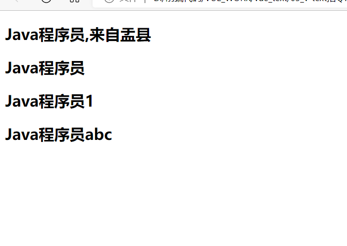

# Vue.js

# **1.1** ***Vue.js*** ***介绍***

## **1.1.1**Vue.js是什么?

​           Vue (读音 /vjuː/，类似于 view) 是一套用于构建用户界面的渐进式框架。与其它大型框架不同的是，Vue 被设计为可以自底向上逐层应用.

​           Vue 的核心库只关注视图层，不仅易于上手，还便于与第三方库或既有项目整合。另一 方面，当与现代化的工具链以及各种支持类库结合使用时，Vue 也完全能够为复杂的单页应用提供驱动。

​          自底向上逐层应用：作为渐进式框架要实现的目标就是方便项目增量开发(即插即用)。

官方网站:	https://cn.vuejs.org/v2/guide/ 作者 尤雨溪是中国人.

## **1.1.2** ***为甚么使用******Vue?***

1. 声明式渲染: 前后端分离是未来趋势

2. 渐进式框架: 适用于各种业务需求

3. 简单易学: 国人开发,中文文档,不存在语言障碍,易于理解和学习

# **1.2** ***Vue.js*** 基础

## **1.2.1** Vue.js的使用

1. 在html页面使用script引入vue.js的库即可使用。

```js
远程CDN
<script src="https://cdn.jsdelivr.net/npm/vue@2.5.16/dist/vue.js"></script>
本地
<script src="vue.min.js"></script> 
```

```
2. Vue-CLI脚手架:使用vue.js官方提供的CLI脚本架很方便去创建vue.js工程雏形
```

## **1.2.2** 入门程序

创建一个vuetest目录, 并且在目录下创建 01_vue入门程序.html 文件. 代码编写步骤：

1、定义html，引入vue.js

2、定义app  div，此区域作为vue的接管区域3、定义Vue实例，接管app区域。

4、定义model（数据对象）

5、在app中展示数据

```html
<!DOCTYPE html>
<html lang="en">
<head>
    <meta charset="UTF-8">
    <meta name="viewport" content="width=device-width, initial-scale=1.0">
    <meta http-equiv="X-UA-Compatible" content="ie=edge">
    <title>Document</title>
</head>
<!--引入Vue.js-->
<!-- <script src="https://cdn.jsdelivr.net/npm/vue@2.5.16/dist/vue.js"></script> -->
<!-- 本地引入 -->
<script src="./js/vue.min.js"></script>
<body>
    <!-- 1.创建id为app的div -->
    <div id="app">
        {{name }}
    </div>
</body>
<script>
//2.创建vue实例
var VM = new Vue({

//3.定义 Vue实例挂载的元素节点,表示vue接管该div 
el:"#app",
//4.定义model模型数据对象
data:{
    name: "Hello Vue!!!"
}
})


</script>
</html>
```

### **1.** {{}}: 插值表达式

1. 插值表达式的作用?

通常用来获取Vue实例中定义的数据(data) 属性节点中 不能够使用插值表达式

### **2.** el:挂载点

1. el的作用 ?

定义 Vue实例挂载的元素节点,表示vue接管该区域

2. Vue的作用范围是什么 ?

Vue会管理el选项命中的元素,及其内部元素

3. el选择挂载点时,是否可以使用其他选择器 ?

可以,但是建议使用 ID选择器

4. 是否可以设置其他的DOM元素进行关联 ?

可以但是建议选择DIV, 不能使用HTML和Body标签

### **3.** data: ***数据对象***

1. Vue中用到的数据定义在data中

2. data中可以写复杂类型

3. 渲染复杂类型数据的时候,遵守js语法

   ```html
   <!DOCTYPE html>
   <html lang="en">
   <head>
       <meta charset="UTF-8">
       <meta name="viewport" content="width=device-width, initial-scale=1.0">
       <meta http-equiv="X-UA-Compatible" content="ie=edge">
       <title>Document</title>
   </head>
   <!--引入Vue.js-->
   <!-- <script src="https://cdn.jsdelivr.net/npm/vue@2.5.16/dist/vue.js"></script> -->
   <!-- 本地引入 -->
   <script src="./js/vue.min.js"></script>
   <body>
       <!-- 1.创建id为app的div -->
       <div id="app">
           {{name }} <br>
           {{school.name}} {{school.mobile}} <br>
           <ul>
               <li>{{naems[0]}}</li>
               <li>{{naems[1]}}</li>
               <li>{{naems[2]}}</li>
           </ul>
       </div>
   </body>
   <script>
   //2.创建vue实例
   var VM = new Vue({
   
   //3.定义 Vue实例挂载的元素节点,表示vue接管该div 
   el:"#app",
   //4.定义model模型数据对象
   data:{
       name: "Hello Vue!!!",
       //对象类型
       school:{
          name:"拉钩教育", 
          mobile:"1001001"
       },
       //数组类型
       naems:["崔巍","大头","胡斌"],
       
      },
   });
   </script>
   </html>
   ```

## **1.2.3** ***声明式渲染的好处***

Vue中的声明式渲染,简单理解就是我们声明数据,Vue帮我们将数据渲染到HTML.

```html
<!DOCTYPE html>
<html lang="en">
<head>
    <meta charset="UTF-8">
    <meta name="viewport" content="width=>, initial-scale=1.0">
    <meta http-equiv="X-UA-Compatible" content="ie=edge">
    <title>Document</title>
</head>
<body>
    <div id="app">
        {{name}}
    </div>
</body>
<script src="./js/jquery-1.8.3.min.js"></script>
<!-- <script>
$(document).ready(function () {
$("#app").append("<h2>Hello Word! !</h2>");
});
</script> -->
<script src="./js/vue.min.js"></script>
<script>
    var VM = new Vue({
        el: "#app",
        data : {
            name :"Hello world !!"
        },
    });
</script>
</html>
```

## **1.2.4** Vue常用指令

根据官网的介绍，指令 是带有 v- 前缀的特殊属性。通过指令来操作DOM元素

### **1.** ***v-text*** ***指令***

作用: 获取data数据, 设置标签的内容.

注意: 默认写法会替换全部内容,使用插值表达式{{}}可以替换指定内容.

代码示例：

```
<!DOCTYPE html>
<html lang="en">
<head>
    <meta charset="UTF-8">
    <meta name="viewport" content="width=device-width, initial-scale=1.0">
    <meta http-equiv="X-UA-Compatible" content="ie=edge">
    <title>Document</title>
</head>
<script src="./js/vue.min.js"></script>
<body>
    <div id="app">
        <!-- 插值表达式不会覆盖原本的内容 -->
        <h2>{{message}},来自盂县</h2>
        <!-- v-text  获取data数据，设置标签的内容 -->
        <!-- v-text会覆盖原本的内容 -->
        <h2 v-text = "message">来自盂县/h2>
        <!-- v-text能进行字符串的拼接 -->
        <h2 v-text = "message +1"></h2>
        <h2 v-text = "message+'abc'"></h2>
    </div>
</body>
<script>
    var VM = new Vue({
       el: "#app",
       data : {
           message: "Java程序员",
       }
    });
</script>
</html>
```

注意：

1. 插值表达式不会覆盖原本的内容
2. v-text会覆盖原本的内容
3. v-text能进行字符串的拼接

运行结果：



### **2.** **v-html** **指令**

作用: 设置元素的 innerHTML (可以向元素中写入新的标签)

### ***\*代码示例\****


|      |                                                              |
| ---- | ------------------------------------------------------------ |
|      |  |

 


 

**3.** **v-on** **指令**

作用: 为元素绑定事件, 比如: v-on:click,可以简写为 @click="方法"

绑定的方法定义在 VUE实例的, method属性中

### ***\*语法格式\****


|      |                                                              |
| ---- | ------------------------------------------------------------ |
|      |  |

 


 

**代码示例**


|      |                                                              |
| ---- | ------------------------------------------------------------ |
|      |  |

 


 

**4.** **计数器案例**

1) 编码步骤

\1. data中定义数据: 比如 num 值为1

\2. methods中添加两个方法: 比如add(递增) ,sub(递减)

\3. 使用{{}} 将num设置给 span标签

\4. 使用v-on 将add,sub 分别绑定给 + ,- 按钮

\5. 累加到10 停止

\6. 递减到0 停止

2) 页面准备


|      |                                                              |
| ---- | ------------------------------------------------------------ |
|      |  |

 


 

3) 案例演示


|      |                                                              |
| ---- | ------------------------------------------------------------ |
|      |  |

 


 

4) 案例总结

创建VUE实例时: **el(****挂载点****) , data(****数据****) , methods(****方法****) v-on** 指令的作用是绑定事件,简写为 **@**

方法中使用**this**关键字,获取data中的数据

**v-text** 与 **{{}}** 的作用都是用来 设置元素的文本值

### **5.** ***\*v-show\*******\*指令\****

作用: v-show指令, 根据真假值,切换元素的显示状态

### ***\*页面准备\****


|      |                                                              |
| ---- | ------------------------------------------------------------ |
|      |  |

 


 

**代码示例**


|      |                                                              |
| ---- | ------------------------------------------------------------ |
|      |  |

 


 

**v-show** **指令总结**

原理是修改元素的display,实现显示或者隐藏指令后面的内容,最终会解析为 布尔值

值为true 显示, 为false 则隐藏

数据改变之后,显示的状态会同步更新

### **6.** ***\*v-if\**** ***\*指令\****

作用: 根据表达值的真假,切换元素的显示和隐藏( 操纵dom 元素 )

### ***\*代码示例\****


|      |                                                              |
| ---- | ------------------------------------------------------------ |
|      |  |

 


 

v-if 指令总结

v-if 指令的作用: 根据表达式的真假切换元素的显示状态本质是通过操作dom元素,来切换显示状态

表达式为true 元素存在与dom树,为false从dom树中移除频繁切换使用 v-show ,反之使用v-if

 

 

### **7.** ***\*v-bind\**** ***\*指令\****

作用: 设置元素的属性 （比如:src,title,class）


 

### ***\*代码示例\****


|      |                                                              |
| ---- | ------------------------------------------------------------ |
|      |  |

 


 

**v-bind****指令总结**

v-bind 指令的作用是： 为元素绑定属性

完整写法 **v-bind:****属性名**，可以简写为 **:****属性名**

 

### **8.** ***\*v-for\**** ***\*指令\****

作用: 根据数据生成列表结构

### ***\*语法结构\****


|      |                                                              |
| ---- | ------------------------------------------------------------ |
|      |  |

 


 

**代码示例**

 

<body>

<div id="app">


<input type="button" value="添加数据" @click="add">

<input type="button" value="移除数据" @click="remove">

<ul>

<!-- 在li标签中获取数组元素 -->

<li v-for="(item,index) in arr">

{{index+1 }}城市: {{item}}

</li>

</ul>

 

<!-- 使用h2标签显示

v-for 结合 v-bind一起使用

-->

<h2 v-for="p in	persons" v-bind:title="p.name">

{{p.name}}

</h2>

</div>

</body>

 

 

<script src="./vue.min.js"></script>

<script>

var VM = new Vue({ el:"#app", data:{

//普通数组

arr:["上海","北京","天津","杭州"],

//对象数组persons:[

{name:"尼古拉斯·赵四"},

{name:"莱安纳多·小沈阳"}

]

},

methods: {

add:function(){

//push 添加

this.persons.push({name:"多利安·刘能"})

},

remove:function(){ this.persons.shift();


 

### ***\*v-for\*******\*指令总结\****

v-for 指令的作用: 根据数据生成列表结构

数组经常和 v-for结合使用,数组有两个常用方法: push() 向数组末尾添加一个或多个元素

shift() 把数组中的第一个元素删除

语法是: (item,index) in 数据

item和index 可以结合其他指令一起使用

数组的长度变化,会同步更新到页面上,是响应式的

### **9.** ***\*v-on\**** ***\*指令补充\****

\1. 传递自定义参数 : 函数调用传参

\2. 事件修饰符: 对事件触发的方式进行限制

### ***\*代码示例\****


|      |                                                              |
| ---- | ------------------------------------------------------------ |
|      |  |

 


 

**总结**

事件绑定方法,可以传入自定义参数

定义方法时,需要定义形参,来接收实际的参数


事件的后面跟上 .修饰符 可以对事件进行限制

.enter 可以限制触发的按键为回车

事件修饰符有许多 使用时可以查询文档

### **10.** ***\*MVVM\*******\*模式\****

MVVM 是Model-View-ViewModel 的缩写，它是一种基于前端开发的架构模式. MVVM模式将页面,分层了 M 、V、和VM ,解释为：

Model: 负责数据存储

View: 负责页面展示

View Model: 负责业务逻辑处理（比如Ajax请求等），对数据进行加工后交给视图展示


|      |                                                              |
| ---- | ------------------------------------------------------------ |
|      |  |

 


 

 

首先，我们将上图中的DOM Listeners和Data Bindings看作两个工具，它们是实现双向绑定的关键。

从View侧看，ViewModel中的DOM Listeners工具会帮我们监测页面上DOM元素的变化，如果有变化，则更改Model中的数据；

从Model侧看，当我们更新Model中的数据时，Data Bindings工具会帮我们更新页面中的DOM元素。


MVVM的思想,主要是为了让我们的开发更加的方便,因为MVVM提供了**数据的双向绑定**

### **11.** ***\*v-mode\**** ***\*指令\****

作用: 获取和设置表单元素的值(实现双向数据绑定)

### ***\*双向数据绑定\****

单向绑定: 就是把Model绑定到View，当我们用JavaScript代码更新Model时，View就会自动更新。

双向绑定: 用户更新了View，Model的数据也自动被更新了，这种情况就是双向绑定。什么情况下用户可以更新View呢？

填写表单就是一个最直接的例子。当用户填写表单时，View的状态就被更新了，如果此时

MVVM框架可以自动更新Model的状态，那就相当于我们把Model和View做了双向绑定：

### ***\*代码示例\****


|      |                                                              |
| ---- | ------------------------------------------------------------ |
|      |  |

 


 

**v-model****指令总结**

v-model 指令的作用是便捷的设置和获取表单元素的值绑定的数据会和表单元素值相关联

双向数据绑定

## **1.2.5** ***\*实现简单记事本\****


### **1.** ***\*功能介绍\****

**2.** **新增内容**

步骤

\1. 生成列表结构(v-for 数组)

\2. 获取用户输入(v-model 双向绑定)

\3. 回车,新增数据(v-on .enter事件修饰符)

\4. 页面布局不熟悉,可以通过审查元素的方式快速找到元素

 

<body>

<!-- VUE示例接管区域 -->

<section id="app">


<!-- 输入框 -->

<header class="header">

<h1>VUE记事本</h1>

 

<!-- v-on 绑定事件 -->

<input v-model="inputValue" @keyup.enter="add" autofocus="autofocus" autocomplete="off" placeholder="输入日程"

class="new-todo"/>

</header>

 


 

 

 

 

 

 

 

 

 

</label>

<!-- 列表区域 -->

<section class="main">

<ul class="listview">

<li class="todo" v-for="(item,index) in list">

<div class="view">

<span class="index">{{index+1}}</span> <label>{{item}}

 

 

<button class="destroy"></button>

</div>

</li>

</ul>

</section>

</section>


</body>

<script src="https://cdn.jsdelivr.net/npm/vue/dist/vue.js"></script>

<script>

var VM = new Vue({ el:"#app", data:{

list:["写代码","吃饭","睡觉"],

inputValue:"996还是997"

},

methods: {

//新增方法add:function(){

//将用户输入的内容添加到list this.list.push(this.inputValue);

}

}

})

</script>


### **3.** ***\*删除内容\****

步骤

\1. 点击删除指定的内容( 根据索引删除元素)

\2. 在methods中添加一个删除的方法,使用splice函数进行删除


|      |                                                              |
| ---- | ------------------------------------------------------------ |
|      |  |

 


 

 

### **4.** ***\*统计操作\****

步骤

\1. 统计页面信息的个数,就是列表中的元素的个数.

\2. 获取 list数组的长度,就是信息的个数


|      |                                                              |
| ---- | ------------------------------------------------------------ |
|      |  |

 


 

总结:

\1. 基于数据的开发方式

\2. v-text设置的是文本,可以使用简化方式 {{}}

### **5.** ***\*清空数据\****

步骤:

\1. 点击清除所有信息

\2. 本质就是清空数组


|      |                                                              |
| ---- | ------------------------------------------------------------ |
|      |  |

 


 

# **1.3** ***\*axios\****

## **1.3.1** ***\*Ajax\*******\*回顾\****

### **1.3.1.1** ***\*什么是\*******\*Ajax?\****

Ajax 是指一种创建交互式网页应用的开发技术。Ajax = 异步 JavaScript 和 XML。

### **1.3.1.2** ***\*Ajax\*******\*的作用\****

Ajax 可以使网页实现异步更新。这意味着可以在不重新加载整个网页的情况下，对网页的某部分进行更新（局部更新）。传统的网页如果需要更新内容，必须重载整个网页页面。

简单记: Ajax 是一种在无需重新加载整个网页的情况下，能够更新部分网页的技术, 维护用户体验性, 进行网页的局部刷新.

### **1.3.1.3** ***\*异步与同步\****

浏览器访问服务器的方式


|      |                                                              |
| ---- | ------------------------------------------------------------ |
|      |  |

同步访问:  客户端必须等待服务器端的响应,在等待过程中不能进行其他操作异步访问: 客户端不需要等待服务的响应,在等待期间,浏览器可以进行其他操作


### **1.3.1.4** ***\*案例演示\****

ajax.jsp


|      |                                                              |
| ---- | ------------------------------------------------------------ |
|      |  |

 


 

servlet


|      |                                                              |
| ---- | ------------------------------------------------------------ |
|      |  |

 


 

 

## **1.3.1** ***\*axios\*******\*介绍\****

VUE中结合网络数据进行应用的开发

目前十分流行网络请求库,专门用来发送请求,其内部还是ajax,进行封装之后使用更加方便

axios作用: 在浏览器中可以帮助我们完成 ajax异步请求的发送.

Vue2.0之后，尤雨溪推荐大家用axios替换JQuery ajax

## **1.3.2** ***\*axios\*******\*入门\****

使用步骤:

\1. 导包


|      |                                                              |
| ---- | ------------------------------------------------------------ |
|      |  |

 


 

\2. 请求方式,以GET和POST举例

### ***\*GET\****


|      |                                                              |
| ---- | ------------------------------------------------------------ |
|      |  |

 


 


|      |                                                              |
| ---- | ------------------------------------------------------------ |
|      |  |

 


 

 

**POST**


|      |                                                              |
| ---- | ------------------------------------------------------------ |
|      |  |

 


 

\3. 根据接口文档, 访问测试接口,进行测试

### ***\*接口\*******\*1:\*******\*随机笑话\****


|      |                                                              |
| ---- | ------------------------------------------------------------ |
|      |  |

 


 

**接口****2:****用户注册**


 

**代码示例**


|      |                                                              |
| ---- | ------------------------------------------------------------ |
|      |  |

 


 

**1.3.3** **axios****总结**

\1. **axios** **必须导包才能使用**

\2. **使用****get****或者****post****方法****,****就可以发送请求**

\3. **then****方法中的回调函数****,****会在请求成功或者请求失败的时候触发**

\4. **通过回调函数的形参可以获取响应的内容****,****或者错误信息**

**1.3.4** **获取笑话案例**


通过vue+axios 完成一个获取笑话的案例.

### ***\*接口\*******\*:\**** ***\*随机获取一条笑话\****


|      |                                                              |
| ---- | ------------------------------------------------------------ |
|      |  |

 


 

**代码示例**


|      |                                                              |
| ---- | ------------------------------------------------------------ |
|      |  |

 


 

**案例总结**

\1. axios回调函数中this指向已经改变,无法访问data中的数据


\2. 解决方案: 将this进行保存,回调函数中直接使用保存的this即可

## **1.3.5** ***\*天气查询案例\****

### **1.3.5.1** ***\*需求分析\****

功能分析: 回车查询

\1. 输入内容,点击回车 (v-on.enter)

\2. 访问接口,查询数据 (axios v-model) 3.返回数据,渲染数据

### **1.3.5.2** ***\*接口文档\****


|      |                                                              |
| ---- | ------------------------------------------------------------ |
|      |  |

 


 

**1.3.5.3** **案例演示****自定义****JS****文件**

作为一个标准的应用程序,我们将创建VUE实例的代码,抽取到main.js 文件中

main.js


|      |                                                              |
| ---- | ------------------------------------------------------------ |
|      |  |

 


|      |                                                              |
| ---- | ------------------------------------------------------------ |
|      |  |

 


 

### **1.3.5.4** ***\*案例总结\****

\1. 应用的逻辑代码,建议与页面进行分离,使用单独的JS编写

\2. axios回调函数中的 this的指向改变,无法正常使用, 需要另外保存一份

\3. 服务器返回的数据比较的复杂时,获取数据时要注意层级结构

## **1.3.6** ***\*解决页面闪烁问题\****

我们发现访问天气预报案例页面时, 使用插值表达式的地方出现了闪烁问题,如何解决呢?

### ***\*v-cloak\*******\*指令\****

作用: 解决插值表达式闪烁问题

当网络较慢，网页还在加载 Vue.js ，而导致 Vue 来不及渲染，这时页面就会显示出 Vue 源代码。我们可以使用 v-cloak 指令来解决这一问题。

1) 添加样式


 

2) 在id为app的div中添加 v-cloak


|      |                                                              |
| ---- | ------------------------------------------------------------ |
|      |  |

 


 

# **1.4** ***\*computed\**** ***\*计算属性\****

## **1.4.1** ***\*什么是计算属性\****

在Vue应用中，在模板中双向绑定一些数据或者表达式，但是表达式如果过长，或者逻辑更为复杂时，就会变得臃肿甚至难以维护和阅读，比如下面的代码:


|      |                                                              |
| ---- | ------------------------------------------------------------ |
|      |  |

 


 

computed 的作用: 减少运算次数, 缓存运算结果. 运用于重复相同的计算.

## **1.4.1** ***\*代码示例\****


|      |                                                              |
| ---- | ------------------------------------------------------------ |
|      |  |

 


 

**1.4.2** **computed****总结**

\1. 定义函数也可以实现与 计算属性相同的效果,都可以简化运算。

\2. 不同的是**计算属性是基于它们的响应式依赖进行缓存的**。只在相关响应式依赖发生改变时它们才会  重新求值。

# **1.5** ***\*filter\**** ***\*过滤器\****

## **1.5.1** ***\*什么是过滤器\****

过滤器是对即将显示的数据做进一步的筛选处理，然后进行显示，值得注意的是过滤器并没有改变原  来的数据，只是在原数据的基础上产生新的数据。

数据加工车间,对值进行筛选加工.

## **1.5.2** ***\*过滤器使用位置\****

\1. 双括号插值内


|      |                                                              |
| ---- | ------------------------------------------------------------ |
|      |  |

 


 

\2. v-bind绑定的值的地方。


|      |                                                              |
| ---- | ------------------------------------------------------------ |
|      |  |

 


 

## **1.5.3** ***\*过滤器\****

### **1.** ***\*局部过滤器\****

需求: 通过过滤器给电脑价格前面 添加一个符号¥


|      |                                                              |
| ---- | ------------------------------------------------------------ |
|      |  |

 


 

### **2.** ***\*全局过滤器\****

需求: 将用户名开头字母大写


|      |                                                              |
| ---- | ------------------------------------------------------------ |
|      |  |

 


 

## **1.5.4** ***\*总结\****

\1. 过滤器常用来处理文本格式化的操作。过滤器可以用在两个地方：**双花括号插值和** **v-bind** **表达式**

\2. 过滤器应该被添加在 JavaScript 表达式的尾部，由“管道”符号指示

# **1.6** ***\*watch\**** ***\*侦听器\****

## **1.6.1** ***\*什么是侦听器\****

Vue.js 提供了一个方法 watch，它用于观察Vue实例上的数据变动。

作用: 当你有一些数据需要随着其它数据变动而变动时，可以使用侦听属性

## **1.6.2** ***\*案例演示\****

需求: 监听姓名变化,实时显示


 

 


|      |                                                              |
| ---- | ------------------------------------------------------------ |
|      |  |

 


 

 

# **1.7** ***\*Component\**** ***\*组件\****

## **1.7.1** ***\*组件介绍\****

组件（Component）是自定义封装的功能。在前端开发过程中，经常出现多个网页的功能是重复的，而且很多不同的页面之间，也存在同样的功能。

我们将相同的功能进行抽取,封装为组件,这样，前端人员就可以在组件化开发时，只需要书写一次代 码，随处引入即可使用。

组件系统让我们可以用独立可复用的小组件来构建大型应用，几乎任意类型的应用的界面都可以抽象  为一个组件树


 

 

 

 

### ***\*vue\*******\*的组件有两种\*******\*:\**** ***\*全局组件 和 局部组件\****

**1.7.2** **全局组件**

语法格式:


|      |                                                              |
| ---- | ------------------------------------------------------------ |
|      |  |

 


 

注意:

\1. 组件名以小写开头，采用短横线分割命名: 例如 **hello-Word**

\2. 组件中的data 必须是一个函数,注意与Vue实例中的data区分

\3. 在template模板中, 只能有一个根元素


|      |                                                              |
| ---- | ------------------------------------------------------------ |
|      |  |

 


 

## **1.7.3** ***\*局部组件\****

相比起全局组件，局部组件只能在同一个实例内才能被调用。局部组件的写法和全局组件差不多。  **唯****一不同就是：局部组件要写在****Vue****实例里面。**


|      |                                                              |
| ---- | ------------------------------------------------------------ |
|      |  |

 


 

注意:

创建局部组件，注意 components，注意末尾有 ‘s’，而全局组件是不用+ ‘s’ 的。这意味着，

components 里可以创建多个组件。


|      |                                                              |
| ---- | ------------------------------------------------------------ |
|      |  |

 


 

## **1.7.4** ***\*组件与模板分离\****

由于把html语言写在组件里面很不方便，也不太好看所以将它们分开写。


|      |                                                              |
| ---- | ------------------------------------------------------------ |
|      |  |

 


 

总结:

\1. 上面这种写法，浏览器会把 html 里的 template 标签过滤掉。所以 template 标签的内容是不会在页面中展示的。直到它被 JS 中的 Vue 调用。

\2. 在 html 中，template 标签一定要有一个 id，因为通过 id 是最直接被选中的。 data 和 methods

等 参数，全部都要放到 Vue 实例里面写

# **1.8** ***\*Vue\*******\*生命周期\****

## **1.8.1** ***\*生命周期图示\****


每个Vue实例在被**创建**之前都要经过一系列的初始化过程,这个过程就是vue的生命周期了解生命周期的好处:

\1. 找错误

\2. 解决需求

下图展示了实例的生命周期。你不需要立马弄明白所有的东西，不过随着你的不断学习和使用，它的参  考价值会越来越高。


|      |                                                              |
| ---- | ------------------------------------------------------------ |
|      |  |

 


 

 

 

## **1.8.2** ***\*钩子函数介绍\****

生命周期中的钩子函数

钩子函数：钩子函数是在一个事件触发的时候，在系统级捕获到了他，然后做一些操作

 

| **函数**             | **说明**                                              |
| -------------------- | ----------------------------------------------------- |
| **beforeCreate()**   | 在创建Vue实例之前,可以执行这个方法. 例如 加载动画操作 |
| **created()**        | 实例创建完成,属性绑定好了,但是DOM还没有生成.          |
| **beforeMount()**    | 模板已经在内存中编辑完成了，尚未被渲染到页面中.       |
| **mounted()**        | 内存中的模板已经渲染到页面，用户已经可以看见内容.     |
| **beforeUpdate()**   | 数据更新的前一刻 , 组件在发生更新之前,调用的函数      |
| **updated()**        | updated执行时，内存中的数据已更新，并且页面已经被渲染 |
| **beforeDestroy** () | 钩子函数在实例销毁之前调用                            |
| **destroyed** ()     | 钩子函数在Vue 实例销毁后调用                          |

## **1.8.3** ***\*案例演示\****


|      |                                                              |
| ---- | ------------------------------------------------------------ |
|      |  |

 


 

**1.9** **Vue** **Router** **路由**

**1.9.1** **什么是路由****?**

在Web开发中，路由是指根据URL分配到对应的处理程序。 路由允许我们通过不同的 URL 访问不同的内容。

通过 Vue.js 可以实现多视图单页面web应用（single page web application，SPA）


|      |                                                              |
| ---- | ------------------------------------------------------------ |
|      |  |

 


## **1.9.2** ***\*什么是\*******\*SPA\**** ***\*?\****

百度百科


单页面Web应用（single page web application，SPA），就是只有一张Web页面的应用， 是加载单个HTML 页面并在用户与应用程序交互时动态更新该页面的Web应用程序。

 

单页应用不存在页面跳转，它本身只有一个HTML页面。我们传统意义上的页面跳转在单页应用的概念下转变为了body 内某些元素的替换和更新，举个例子:


|      |                                                              |
| ---- | ------------------------------------------------------------ |
|      |  |

 


 

整个body的内容从登录组件变成了欢迎页组件, 从视觉上感受页面已经进行了跳转。但实际上，页面只是随着用户操作，实现了局部内容更新,依然还是在index.html 页面中。

 

单页面应用的好处:

\1. 用户操作体验好，用户不用刷新页面，整个交互过程都是通过Ajax来操作。

\2. 适合前后端分离开发，服务端提供http接口，前端请求http接口获取数据，使用JS进行客户端渲染。

## **1.9.3** ***\*路由相关的概念\****

### ***\*router\**** :

是 Vue.js 官方的路由管理器。它和 Vue.js 的核心深度集成，让构建单页面应用（SPA）变得易如反掌 ,router 就相当于一个管理者，它来管理路由。

### ***\*route\****:

ruter相当于路由器, route就相当于一条路由.比如: Home按钮 => home内容， 这是一条route, news按钮 => news内容， 这是另一条路由。

### ***\*routes\**** :

是一组路由，把上面的每一条路由组合起来，形成一个数组。[{home 按钮 =>home内容 }， { about按钮 => about 内容}]

### ***\*router-link\*******\*组件\****:

router-link 是一个组件，是对标签的一个封装. 该组件用于设置一个导航链接，切换不同 HTML

内容。 **to** 属性为目标地址， 即要显示的内容

**router-view** **组件**:

路由导航到指定组件后,进行渲染显示页面.

## **1.9.4** ***\*使用路由\****


1) Vue.js 路由需要载入 vue-router 库


|      |                                                              |
| ---- | ------------------------------------------------------------ |
|      |  |

 


 

2) 使用步骤

\1. 定义路由所需的组件

\2. 定义路由 每个路由都由两部分 path (路径) 和component (组件)

\3. 创建router路由器实例 ,管理路由

\4. 创建Vue实例, 注入路由对象, 使用$mount() 指定挂载点


|      |                                                              |
| ---- | ------------------------------------------------------------ |
|      |  |

 


 

3) HTM代码


|      |                                                              |
| ---- | ------------------------------------------------------------ |
|      |  |

 


 

4) JS代码


|      |                                                              |
| ---- | ------------------------------------------------------------ |
|      |  |

 


 

## **1.9.5** ***\*路由总结\****

\1. router是Vue中的路由管理器对象,用来管理路由.

\2. route是路由对象,一个路由就对应了一条访问路径,一组路由用routes表示

\3. 每个路由对象都有两部分 path(路径)和component (组件)

\4. router-link 是对a标签的封装,通过to属性指定连接

\5. router-view  路由访问到指定组件后,进行页面展示

\###