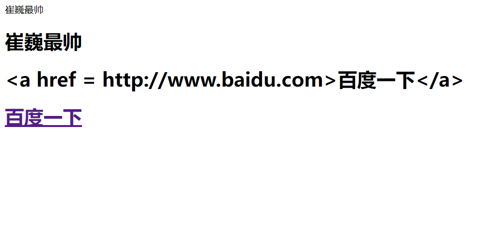
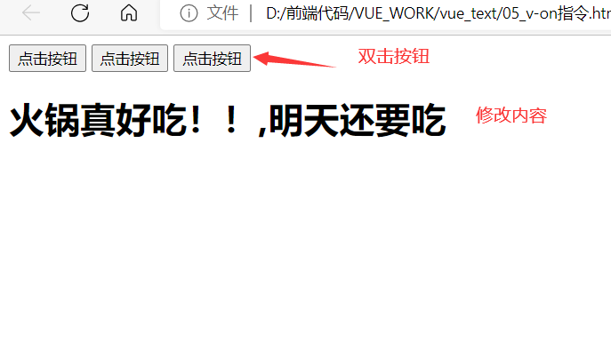
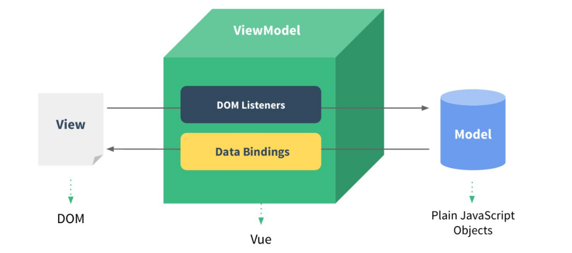
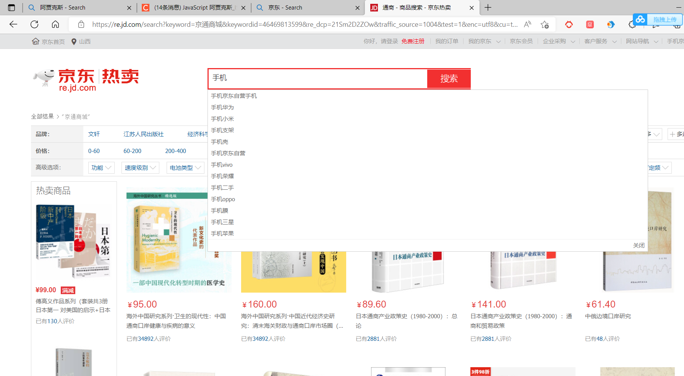
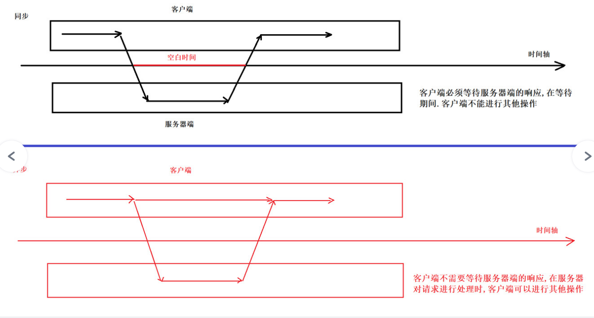
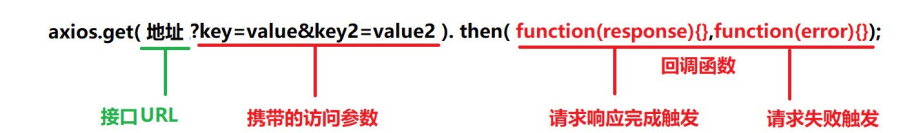

# gVue.js

# **1.1** ***Vue.js*** ***介绍***

## **1.1.1**Vue.js是什么?

​           Vue (读音 /vjuː/，类似于 view) 是一套用于构建用户界面的渐进式框架。与其它大型框架不同的是，Vue 被设计为可以自底向上逐层应用.

​           Vue 的核心库只关注视图层，不仅易于上手，还便于与第三方库或既有项目整合。另一 方面，当与现代化的工具链以及各种支持类库结合使用时，Vue 也完全能够为复杂的单页应用提供驱动。

​          自底向上逐层应用：作为渐进式框架要实现的目标就是方便项目增量开发(即插即用)。

官方网站:	https://cn.vuejs.org/v2/guide/ 作者 尤雨溪是中国人.

## **1.1.2** ***为甚么使用******Vue?***

1. 声明式渲染: 前后端分离是未来趋势

2. 渐进式框架: 适用于各种业务需求

3. 简单易学: 国人开发,中文文档,不存在语言障碍,易于理解和学习

# **1.2** ***Vue.js*** 基础

## **1.2.1** Vue.js的使用

1. 在html页面使用script引入vue.js的库即可使用。

```js
远程CDN
<script src="https://cdn.jsdelivr.net/npm/vue@2.5.16/dist/vue.js"></script>
本地
<script src="vue.min.js"></script> 
```

```
2. Vue-CLI脚手架:使用vue.js官方提供的CLI脚本架很方便去创建vue.js工程雏形
```

## **1.2.2** 入门程序

创建一个vuetest目录, 并且在目录下创建 01_vue入门程序.html 文件. 代码编写步骤：

1、定义html，引入vue.js

2、定义app  div，此区域作为vue的接管区域3、定义Vue实例，接管app区域。

4、定义model（数据对象）

5、在app中展示数据

```html
<!DOCTYPE html>
<html lang="en">
<head>
    <meta charset="UTF-8">
    <meta name="viewport" content="width=device-width, initial-scale=1.0">
    <meta http-equiv="X-UA-Compatible" content="ie=edge">
    <title>Document</title>
</head>
<!--引入Vue.js-->
<!-- <script src="https://cdn.jsdelivr.net/npm/vue@2.5.16/dist/vue.js"></script> -->
<!-- 本地引入 -->
<script src="./js/vue.min.js"></script>
<body>
    <!-- 1.创建id为app的div -->
    <div id="app">
        {{name }}
    </div>
</body>
<script>
//2.创建vue实例
var VM = new Vue({

//3.定义 Vue实例挂载的元素节点,表示vue接管该div 
el:"#app",
//4.定义model模型数据对象
data:{
    name: "Hello Vue!!!"
}
})


</script>
</html>
```

### **1.** {{}}: 插值表达式

1. 插值表达式的作用?

通常用来获取Vue实例中定义的数据(data) 属性节点中 不能够使用插值表达式

### **2.** el:挂载点

1. el的作用 ?

定义 Vue实例挂载的元素节点,表示vue接管该区域

2. Vue的作用范围是什么 ?

Vue会管理el选项命中的元素,及其内部元素

3. el选择挂载点时,是否可以使用其他选择器 ?

可以,但是建议使用 ID选择器

4. 是否可以设置其他的DOM元素进行关联 ?

可以但是建议选择DIV, 不能使用HTML和Body标签

### **3.** data: ***数据对象***

1. Vue中用到的数据定义在data中

2. data中可以写复杂类型

3. 渲染复杂类型数据的时候,遵守js语法

   ```html
   <!DOCTYPE html>
   <html lang="en">
   <head>
       <meta charset="UTF-8">
       <meta name="viewport" content="width=device-width, initial-scale=1.0">
       <meta http-equiv="X-UA-Compatible" content="ie=edge">
       <title>Document</title>
   </head>
   <!--引入Vue.js-->
   <!-- <script src="https://cdn.jsdelivr.net/npm/vue@2.5.16/dist/vue.js"></script> -->
   <!-- 本地引入 -->
   <script src="./js/vue.min.js"></script>
   <body>
       <!-- 1.创建id为app的div -->
       <div id="app">
           {{name }} <br>
           {{school.name}} {{school.mobile}} <br>
           <ul>
               <li>{{naems[0]}}</li>
               <li>{{naems[1]}}</li>
               <li>{{naems[2]}}</li>
           </ul>
       </div>
   </body>
   <script>
   //2.创建vue实例
   var VM = new Vue({
   
   //3.定义 Vue实例挂载的元素节点,表示vue接管该div 
   el:"#app",
   //4.定义model模型数据对象
   data:{
       name: "Hello Vue!!!",
       //对象类型
       school:{
          name:"拉钩教育", 
          mobile:"1001001"
       },
       //数组类型
       naems:["崔巍","大头","胡斌"],
       
      },
   });
   </script>
   </html>
   ```

## **1.2.3** ***声明式渲染的好处***

Vue中的声明式渲染,简单理解就是我们声明数据,Vue帮我们将数据渲染到HTML.

```html
<!DOCTYPE html>
<html lang="en">
<head>
    <meta charset="UTF-8">
    <meta name="viewport" content="width=>, initial-scale=1.0">
    <meta http-equiv="X-UA-Compatible" content="ie=edge">
    <title>Document</title>
</head>
<body>
    <div id="app">
        {{name}}
    </div>
</body>
<script src="./js/jquery-1.8.3.min.js"></script>
<!-- <script>
$(document).ready(function () {
$("#app").append("<h2>Hello Word! !</h2>");
});
</script> -->
<script src="./js/vue.min.js"></script>
<script>
    var VM = new Vue({
        el: "#app",
        data : {
            name :"Hello world !!"
        },
    });
</script>
</html>
```

## **1.2.4** Vue常用指令

根据官网的介绍，指令 是带有 v- 前缀的特殊属性。通过指令来操作DOM元素

### **1.** ***v-text*** ***指令***

作用: 获取data数据, 设置标签的内容.

注意: 默认写法会替换全部内容,使用插值表达式{{}}可以替换指定内容.

代码示例：

```
<!DOCTYPE html>
<html lang="en">
<head>
    <meta charset="UTF-8">
    <meta name="viewport" content="width=device-width, initial-scale=1.0">
    <meta http-equiv="X-UA-Compatible" content="ie=edge">
    <title>Document</title>
</head>
<script src="./js/vue.min.js"></script>
<body>
    <div id="app">
        <!-- 插值表达式不会覆盖原本的内容 -->
        <h2>{{message}},来自盂县</h2>
        <!-- v-text  获取data数据，设置标签的内容 -->
        <!-- v-text会覆盖原本的内容 -->
        <h2 v-text = "message">来自盂县/h2>
        <!-- v-text能进行字符串的拼接 -->
        <h2 v-text = "message +1"></h2>
        <h2 v-text = "message+'abc'"></h2>
    </div>
</body>
<script>
    var VM = new Vue({
       el: "#app",
       data : {
           message: "Java程序员",
       }
    });
</script>
</html>
```

注意：

1. 插值表达式不会覆盖原本的内容
2. v-text会覆盖原本的内容
3. v-text能进行字符串的拼接

运行结果：


### **2.** **v-html** **指令**

作用: 设置元素的 innerHTML (可以向元素中写入新的标签)

代码示例

```html
<!DOCTYPE html>
<html lang="en">
<head>
    <meta charset="UTF-8">
    <meta name="viewport" content="width=device-width, initial-scale=1.0">
    <meta http-equiv="X-UA-Compatible" content="ie=edge">
    <title>Document</title>
</head>
<script src="./js/vue.min.js"></script>
<body>
    <div id="app">
        {{message}}

        <h1 v-text = "message"></h1>

        <!-- v-html设置元素的Innerhtml -->
        <h1 v-text = "url"></h1>
        <h1 v-html = "url"></h1>
    </div>
</body>
<script>
var vm = new Vue({
    el : "#app",
    data : {
        message : "崔巍最帅",
       url: "<a href = http://www.baidu.com>百度一下</a>",  
    },
});

</script>
</html>
```

运行结果：

 

区别:v-text指令直接取走了里面的值，而v-html会进行解析。

### **3.** **v-on** **指令**

作用: 为元素绑定事件, 比如: v-on:click,可以简写为 @click="方法"

绑定的方法定义在 VUE实例的, method属性中

语法格式

```html
<div id="app">
<!-- 使用v-on 绑定click 点击事件 -->
<input type="button" value="点击按钮" v-on:click="方法名">
<!-- 使用 @符号也可以绑定-->
<input type="button" value="点击按钮" @click="方法名">
</div>

var VM = new Vue({ el:"#app",
//通过methods ,专门存放Vue中的方法
methods:{
方法名:function(){ alert("123!")
    }
})
```

补充： @dblclick设置双击按钮。

代码示例:

```html
<!DOCTYPE html>
<html lang="en">
<head>
    <meta charset="UTF-8">
    <meta name="viewport" content="width=device-width, initial-scale=1.0">
    <meta http-equiv="X-UA-Compatible" content="ie=edge">
    <title>Document</title>
</head>
<script src="./js/vue.min.js"></script>
<body>
    <div id="app">
        <input type="button" value="点击按钮" v-on:click = "show">

        <!-- 简写方式 -->
        <input type="button" value="点击按钮" @click = "show">

        <!-- 双击事件 -->
        <input type="button" value="点击按钮" @dblclick = "show">

        <!-- 绑定事件，修改内容 -->
        <h1 @click = "ChangeFood">{{food}}</h1>
    </div>
</body>
<script>
var vm = new Vue({
    el :"#app",
    data : {
        food : "火锅真好吃！！"
    },
    methods: {
        show :function(){
            alert("我是it崔巍")
        },
        ChangeFood : function(){
            this.food = this.food + ",明天还要吃"
        },
    },
});


</script>
</html>
```

运行结果：



### **4.** **计数器案例**

1) 编码步骤

1. data中定义数据: 比如 num 值为1

2. methods中添加两个方法: 比如add(递增) ,sub(递减)

3. 使用{{}} 将num设置给 span标签

4. 使用v-on 将add,sub 分别绑定给 + ,- 按钮

5. 累加到10 停止

6. 递减到0 停

2) 案例演示

```html
<!DOCTYPE html>
<html lang="en">
<head>
    <meta charset="UTF-8">
    <meta name="viewport" content="width=device-width, initial-scale=1.0">
    <meta http-equiv="X-UA-Compatible" content="ie=edge">
    <title>Document</title>
    <link rel="stylesheet" href="./css/inputNum.css">
</head>
<script src="./js/vue.min.js"></script>
<body>
  <div id="#app">
      <!-- Class属性是为了  引用你页面的类样式 -->
    <input type="button" class="btn btn_plus" @click="add">
    <!-- span标签的作用：组合文档中的行内元素。 -->
    <span>{{num}}</span>
    <input type="button" class="btn btn_minus" @click="sub">
  </div>
</body>

<script>
var vm = new Vue({
    el : "#app",
    data :{
      num:1
    },
    methods: {
        add : function(){
            if(this.num <10){
                this.num++;
            }
            else{
              alert("别点了，最大了")
            }
        },
        sub: function(){
            if(this.num>0){
               this.num--;
            }
            else{
                alert("别点了，最小了");
            }
        },
    },
});

</script>
</html>
```

3)案例总结

1) 案例总结

- 创建vue实例时：el（挂载点），data(数据)，methods(方法)
- v-on指令的作用是绑定事件，简写为@
- 方法中使用的this关键字，获取data中的数据
- v-text与{{}}的作用都是用来设置元素的文本值

### **5.** v-show指令

作用: v-show指令, 根据真假值,切换元素的显示状态

**代码示例**

```html
<!DOCTYPE html>
<html lang="en">
<head>
    <meta charset="UTF-8">
    <meta name="viewport" content="width=device-width, initial-scale=1.0">
    <meta http-equiv="X-UA-Compatible" content="ie=edge">
    <title>Document</title>
</head>
<script src="./js/vue.min.js"></script>
<body>
    <div id="app">

        
    </div>
</body>
<script>
var vm = new Vue({

el:"#app",
data:{
    //true就能显示  false不显示
    isShow :false,
    age:19,
},
})
</script>
</html>
```

**v-show** **指令总结**

- 原理是修改元素的display,实现显示或者隐藏
- 指令后面的内容,最终会解析为 布尔值
- 值为true 显示, 为false 则隐藏

- 数据改变之后,显示的状态会同步更新


### **6.** v-if指令

作用: 根据表达值的真假,切换元素的显示和隐藏( 操纵dom 元素 )

***代码示例***

```
<!DOCTYPE html>
<html lang="en">
<head>
    <meta charset="UTF-8">
    <meta name="viewport" content="width=device-width, initial-scale=1.0">
    <meta http-equiv="X-UA-Compatible" content="ie=edge">
    <title>Document</title>
</head>

<script src="./js/vue.min.js"></script>
<body>
    <div id="app">
        <input type="button" value="切换状态" @click = "ChangeIf">
        
    </div>
</body>
<script>
    var vm = new Vue({
    
    el:"#app",
    data:{
        isShow : true
    },
    methods: {
        ChangeIf:function(){
            this.isShow = !this.isShow;
             }
        }
    })
    </script>
</html>
```

v-if 指令总结

- v-if 指令的作用: 根据表达式的真假切换元素的显示状态
- 本质是通过操作dom元素,来切换显示状态  (也就是他的隐藏是把img标签里的内容进行去掉，达到隐藏效果，他的显示则是显示img标签里的内容)
- 表达式为true 元素存在与dom树,为false从dom树中移除
- 频繁切换使用 v-show ,反之使用v-if

### **7.** v-bind指令

作用: 设置元素的属性 （比如:src,title,class）

代码示例：

```html
<!DOCTYPE html>
<html lang="en">
<head>
    <meta charset="UTF-8">
    <meta name="viewport" content="width=device-width, initial-scale=1.0">
    <meta http-equiv="X-UA-Compatible" content="ie=edge">
    <title>Document</title>
</head>
<script src="./js/vue.min.js"></script>
<body>
  
    <div id="app">
  <!-- 设置图片的tilte -->
  
    </div>
</body>
<script>
  var vm = new Vue({
      el:"#app",
      data :{
          imgtitle : "崔巍最帅",
      }
  })


</script>
</html>
```

v-bind指令总结

- v-bind 指令的作用是： 为元素绑定属性

- 完整写法 v-bind:属性名 = 表达式，可以简写为 :属性名 = 表达式


### 8.v-for指令

作用: 根据数据生成列表结构

语法结构

 

```html
</ul>
</div>
<div id="app">
<ul>
<li v-for="item in arr"></li>
var VM = new Vue({ el:"#app", data:{
arr:[1,2,3,4,5],
objArr:[
{name:"tom"},
{name:"jack"}
]
}
})
```

**代码示例**

```html
<!DOCTYPE html>
<html lang="en">
<head>
    <meta charset="UTF-8">
    <meta name="viewport" content="width=device-width, initial-scale=1.0">
    <meta http-equiv="X-UA-Compatible" content="ie=edge">
    <title>Document</title>
</head>
<script src="./js/vue.min.js"></script>
<body>
    <div id="app">'
        <ul>
            <li v-for = "(item,index) in arr">
                    {{index+1 }}城市: {{item}}
            </li>
        </ul>
        <input type="button" value="添加数据" @click="add">
        <input type="button" value="移除数据" @click="remove">
        <!-- 使用h2标签显示
v-for 结合 v-bind一起使用
-->
<h2 v-for="p in	persons" v-bind:title="p.name">
        {{p.name}}
        </h2>
    </div>
    
</body>
<script>
    var vm = new Vue({

  el:"#app",
    data:{
           arr: ["崔巍", "大头","胡斌"],
           persons:[
            {name : "崔巍"},
            {nama : "大头"},
            {name  : "胡斌"},
           ]
    },
    methods: {
        add:function(){
//push 添加
this.persons.push({name:"多利安·刘能"})
},
remove:function(){ 
    this.persons.shift();
       }
    },
 })
</script>
</html>
```

### v-for指令总结

- v-for 指令的作用: 根据数据生成列表结构

- 数组经常和 v-for结合使用,数组有两个常用方法: push() 向数组末尾添加一个或多个元素

- shift() 把数组中的第一个元素删除

- 语法是: (item,index) in 数据

- item和index 可以结合其他指令一起使用

- 数组的长度变化,会同步更新到页面上,是响应式的


### **9.** v-on指令补充

1. 传递自定义参数 : 函数调用传参

2. 事件修饰符: 对事件触发的方式进行限制

代码示例

```html
<!DOCTYPE html>
<html lang="en">
<head>
    <meta charset="UTF-8">
    <meta name="viewport" content="width=device-width, initial-scale=1.0">
    <meta http-equiv="X-UA-Compatible" content="ie=edge">
    <title>Document</title>
</head>
<script src="./js/vue.min.js"></script>
<body>
    <div id="app">
        <!-- 设置参数 -->
            <input type="button" value="点一点" @click="showTime(666,'感谢老铁的穿云箭!')"/>
        <!-- 事件修饰符 -->
        <input type="text" @keyup.enter="hi">
    </div>
</body>
<script>
var vm = new Vue({

    el:"#app",
    data() {
    },
    methods: {
        showTime : function(p1,p2){
            console.log(p1);
             console.log(p2);
        },
        hi : function(){
            alert("宝贝真美")
        }
    },
})

</script>
</html>
```

**总结**

事件绑定方法,可以传入自定义参数

定义方法时,需要定义形参,来接收实际的参数

事件的后面跟上 .修饰符 可以对事件进行限制，可以限制键盘上的键

 @keyup.enter.enter 可以限制触发的按键为回车，点击回车会进行相关的操作

事件修饰符有许多 使用时可以查询文档

### **10.** MVVM模式

- MVVM 是Model-View-ViewModel 的缩写，它是一种基于前端开发的架构模式. 

- MVVM模式将页面,分层了 M 、V、和VM ,解释为：

​                  Model: 负责数据存储

​                  View: 负责页面展示

​                  View Model: 负责业务逻辑处理（比如Ajax请求等），对数据进行加工后交给视图展示

```html
<!DOCTYPE html>
<html lang="en">
<head>
    <meta charset="UTF-8">
    <meta name="viewport" content="width=device-width, initial-scale=1.0">
    <meta http-equiv="X-UA-Compatible" content="ie=edge">
    <title>Document</title>
</head>
<style>
/*
   MVVM:前端的架构模式
   M：Model 负责存储数据
   V：View:负责页面展示
   VM：ViewModel  负责业务处理（MVM模式的核心）
*/
</style>
<body>
    <div id="app">
        <!-- View  视图部分 -->
        <h2>{{name}}</h2>
    </div>
</body>
<script src="./js/vue.min.js"></script>
<script>
    // 创建的vue实例就是  VM ViewModel
    var vm  = new Vue({
        el:"#app",
        // data  就是MVVM中的 Model
        data :{
            name : hello
        }
    })
</script>
</html>
```



- 首先，我们将上图中的DOM Listeners和Data Bindings看作两个工具，它们是实现双向绑定的关键。


1.  从View侧看，ViewModel中的DOM Listeners工具会帮我们监测页面上DOM元素的变化，如果有变化，则更改Model中的数据；

2.  从Model侧看，当我们更新Model中的数据时，Data Bindings工具会帮我们更新页面中的DOM元素。


MVVM的思想,主要是为了让我们的开发更加的方便,因为MVVM提供了**数据的双向绑定**

### **11.** v-model指令

作用: 获取和设置表单元素的值(实现双向数据绑定)

- 双向数据绑定：

​              单向绑定: 当model绑定到View上，model发生变化，view也会随之发生变化

​              双向绑定: view视图发生变化，model也随之发生变化。

- 什么情况下用户可以更新View呢？

​                             填写表单就是一个最直接的例子。当用户填写表单时，View的状态就被更新了，如果此时MVVM框架可以自动更新Model的状态，那就相当于我们把Model和View做了双向绑定：

代码示例：

单向绑定：

```html
<!DOCTYPE html>
<html lang="en">
<head>
    <meta charset="UTF-8">
    <meta name="viewport" content="width=device-width, initial-scale=1.0">
    <meta http-equiv="X-UA-Compatible" content="ie=edge">
    <title>Document</title>
</head>
<script src="./js/vue.min.js"></script>
<body>
    <div id="app">
        <!--  -->
        <input type="text" :value="message"> <br>
        <input type="button" value="你点点呗" @click = "update">

    </div>
</body>
<script>
var vm = new Vue({
    el:"#app",
    data :{
        message : "崔巍最帅"
    },
    methods: {
        update :function(){
            this.message = "崔巍帅吗？"
        }
    },
})
</script>
</html>
```

双向数据绑定;

```html
<!DOCTYPE html>
<html lang="en">
<head>
    <meta charset="UTF-8">
    <meta name="viewport" content="width=device-width, initial-scale=1.0">
    <meta http-equiv="X-UA-Compatible" content="ie=edge">
    <title>Document</title>
</head>
<script src="./js/vue.min.js"></script>
<body>
    <div id="app">
            <input type="text" v-model ="message">
            <input type="text" v-model ="password">
            <h1 v-text = "message"></h1>
    </div>
</body>
<script>
new Vue({
    el:"#app",
    data :{
        message: "我爱你老崔",
        password :"123456999"
    }
})
</script>
</html>
```

v-model指令总结:

- v-model 指令的作用是便捷的设置和获取表单元素的值
- 绑定的数据会和表单元素值相关联
- 双向数据绑定


## **1.2.5** 实现简单记事本

步骤

1. 生成列表结构(v-for 数组)

2. 获取用户输入(v-model 双向绑定)

3. 回车,新增数据(v-on .enter事件修饰符)

4. 页面布局不熟悉,可以通过审查元素的方式快速找到元素


代码实例：

```html
<html>
  <head>
    <meta http-equiv="content-type" content="text/html; charset=UTF-8" />
    <title>小黑记事本</title>
    <meta http-equiv="content-type" content="text/html; charset=UTF-8" />
    <meta name="robots" content="noindex, nofollow" />
    <meta name="googlebot" content="noindex, nofollow" />
    <meta name="viewport" content="width=device-width, initial-scale=1" />
    <link rel="stylesheet" type="text/css" href="../css/index.css" />
  </head>

  <body>
    <!-- VUE示例接管区域 -->
    <section id="app">
      <!-- 输入框 -->++```````
      <header class="header">
        <h1>VUE记事本</h1>
        <input
          autofocus="autofocus"
          autocomplete="off"
          placeholder="输入日程"
          class="new-todo"
          v-model="inputValue"
          @keyup.enter="add"
        />
      </header>

      <!-- 列表区域 -->
      <section class="main">
        <ul class="listview">
          <!-- 1.使用v-for指令 生成列表结构 -->
          <li class="todo" v-for="(item,index) in list">
            <div class="view">
              <span class="index">{{index+1}}</span> <label>{{item}}</label>
              <!-- 2.删除操作 传递index -->
              <button class="destroy" @click="remove(index)"></button>
            </div>
          </li>
        </ul>
      </section>
      <!-- 统计和清空 -->
      <footer class="footer">
        <span class="todo-count">
          <strong>{{list.length}}</strong> items left
        </span>
        <button class="clear-completed" @click="clear()">
          Clear
        </button>
      </footer>
    </section>
  </body>
  <!-- 开发环境版本，包含了有帮助的命令行警告 -->
  <script src="https://cdn.jsdelivr.net/npm/vue/dist/vue.js"></script>
  <script>
    var VM = new Vue({
      el: "#app",
      data: {
        list: ["写代码", "吃饭", "睡觉", "打CSGO"],
        inputValue: "996还是997",
      },
      methods: {
        //新增日程方法
        add: function () {
          //将用户输入的内容添加到list
          this.list.push(this.inputValue);
        },
        remove: function (index) {
          console.log(index);
          //使用 splice(元素的索引,删除几个)
          this.list.splice(index, 1);
        },
        //清空操作
        clear: function () {
          this.list = [];
        },
      },
    });
  </script>
</html>

```

# **1.3** axios

## **1.3.1** Ajax回顾

### **1.3.1.1** 什么是Ajax?

Ajax 是指一种创建交互式网页应用的开发技术。Ajax = 异步 JavaScript 和 XML。

### **1.3.1.2** Ajax的作用

- ​    Ajax 可以使网页实现异步更新。这意味着可以在不重新加载整个网页的情况下，对网页的某部分进行更新（局部更新）。传统的网页如果需要更新内容，必须重载整个网页页面。

- 简单记: Ajax 是一种在无需重新加载整个网页的情况下，能够更新部分网页的技术, 维护用户体验性, 进行网页的局部刷新.

  

像这样，我在搜索手机的时候，会出现很多关于手机的一些的商品，但是总体的页面没有改变，还是主页，而不是跳转到了关于手机的页面。

### **1.3.1.3** 异步与同步

- 浏览器访问服务器的方式：

同步访问:  客户端必须等待服务器端的响应,在等待过程中不能进行其他操作

异步访问: 客户端不需要等待服务的响应,在等待期间,浏览器可以进行其他操作



## **1.3.1** axios介绍

VUE中结合网络数据进行应用的开发：

- 目前十分流行网络请求库,专门用来发送请求,其内部还是ajax,进行封装之后使用更加方便

- axios作用: 在浏览器中可以帮助我们完成 ajax异步请求的发送.


Vue2.0之后，尤雨溪推荐大家用axios替换JQuery ajax

## **1.3.2** axios入门

使用步骤:

1. 导包

```html
<!-- 官网提供的 axios 在线地址 -->
<script src="https://unpkg.com/axios/dist/axios.min.js"></script>
```

2. 请求方式,以GET和POST举例

GET

```
axios.get(地址?key=value&key2=value2).then(function(response){},function(error){});
```

 


POST

```html
axios.post(地址,{key:value,key2:value2}).then(function(response){},function(error){})
```

3. 根据接口文档, 访问测试接口,进行测试

**接口1：随机笑话：**

```
 请求地址:https://autumnfish.cn/api/joke/list 
 请求方法:get
 请求参数:num(笑话条数,数字) 响应内容:随机笑话
 接口2:用户注册
```

代码示例

```html
<!DOCTYPE html>
<html lang="en">
<head>
    <meta charset="UTF-8">
    <meta name="viewport" content="width=device-width, initial-scale=1.0">
    <meta http-equiv="X-UA-Compatible" content="ie=edge">
    <title>Document</title>
</head>
<script src="./js/axios.min.js"></script>
<body>
    <input type="button" value="get请求" id="get">
</body>
<script>
/*
随机笑话接口测试：
 请求地址:https://autumnfish.cn/api/joke/list 
 请求方法:get
 请求参数:num(笑话条数,数字) 响应内容:随机笑话
 接口2:用户注册
 */
document.getElementById("get").onclick = function(){
    axios.get("https://autumnfish.cn/api/joke/list?num=2").then(
        //请求成功
        function(response){
            console.log(response)
            //请求失败
        },function(error){
            console.log(error)
        }
    )
}
</script>
</html>
```

**接口2：用户注册**

```
请求地址:https://autumnfish.cn/api/user/reg 
请求方法:post
请求参数:username(用户名,字符串) 
响应内容:注册成功或失败
```

代码示例：

```html
<!DOCTYPE html>
<html lang="en">
<head>
    <meta charset="UTF-8">
    <meta name="viewport" content="width=device-width, initial-scale=1.0">
    <meta http-equiv="X-UA-Compatible" content="ie=edge">
    <title>Document</title>
</head>
<script src="./js/axios.min.js"></script>
<body>
    <!-- 设置一个按钮 -->
    <input type="button" value="Pst请求" id="post">
</body>
<script>
    /*
    请求地址:https://autumnfish.cn/api/user/reg 
    请求方法:post
    请求参数:username(用户名,字符串) 
    响应内容:注册成功或失败
    */
    // 通过id获取按钮，并添加事件
document.getElementById("post").onclick =  function(){
    axios.get("https://autumnfish.cn/api/user/reg",{username : "cuiwei"})
    .then (function(resp){
            console.log(resp)
    },function(error){
        console.log(error)
    })
}
</script>
</html>
```

## **1.3.3** axios总结

1. axios 必须导包才能使用

2. 使用get或者post方法就可以发送请求

3. then方法中的回调函数会在请求成功或者请求失败的时候触发

4. 通过回调函数的形参可以获取响应的内容或者错误信息

## **1.3.4** **获取笑话案例**

通过vu+axios 完成一个获取笑话的案例.

接口随机获取一条笑话


 

代码示例


案例总结

1. axios回调函数中this指向已经改变,无法访问data中的数据

2. 解决方案: 将this进行保存,回调函数中直接使用保存的this即可

## 1.3.5天气查询案例

### **1.3.5.1** 需求分析

- 功能分析: 回车查询

     1.输入内容，点击回车（v-on.enter）

     2.访问接口，查询数据（axios v-model）

     3.访问数据，渲染数据

### **1.3.5.2** 接口文档

 


 

**1.3.5.3** 案例演示自定义JS文件

作为一个标准的应用程序,我们将创建VUE实例的代码,抽取到main.js 文件中

main.js


### **1.3.5.4** 案例总结

1. 应用的逻辑代码,建议与页面进行分离,使用单独的JS编写

2. axios回调函数中的 this的指向改变,无法正常使用, 需要另外保存一份

3. 服务器返回的数据比较的复杂时,获取数据时要注意层级结构

## **1.3.6** 解决页面闪烁问题

我们发现访问天气预报案例页面时, 使用插值表达式的地方出现了闪烁问题,如何解决呢?

### v-cloak指令

作用: 解决插值表达式闪烁问题

当网络较慢，网页还在加载 Vue.js ，而导致 Vue 来不及渲染，这时页面就会显示出 Vue 源代码。我们可以使用 v-cloak 指令来解决这一问题。

1) 添加样式


 

2) 在id为app的div中添加 v-cloak

 

# **1.4** computed计算属性

## **1.4.1** ***\*什么是计算属性\****

在Vue应用中，在模板中双向绑定一些数据或者表达式，但是表达式如果过长，或者逻辑更为复杂时，就会变得臃肿甚至难以维护和阅读，比如下面的代码:


|      |                                                              |
| ---- | ------------------------------------------------------------ |
|      |  |

 


 

computed 的作用: 减少运算次数, 缓存运算结果. 运用于重复相同的计算.

## **1.4.1** ***\*代码示例\****


|      |                                                              |
| ---- | ------------------------------------------------------------ |
|      |  |

 


 

**1.4.2** **computed****总结**

\1. 定义函数也可以实现与 计算属性相同的效果,都可以简化运算。

\2. 不同的是**计算属性是基于它们的响应式依赖进行缓存的**。只在相关响应式依赖发生改变时它们才会  重新求值。

# **1.5** ***\*filter\**** ***\*过滤器\****

## **1.5.1** ***\*什么是过滤器\****

过滤器是对即将显示的数据做进一步的筛选处理，然后进行显示，值得注意的是过滤器并没有改变原  来的数据，只是在原数据的基础上产生新的数据。

数据加工车间,对值进行筛选加工.

## **1.5.2** ***\*过滤器使用位置\****

\1. 双括号插值内


|      |                                                              |
| ---- | ------------------------------------------------------------ |
|      |  |

 


 

\2. v-bind绑定的值的地方。


|      |                                                              |
| ---- | ------------------------------------------------------------ |
|      |  |

 


 

## **1.5.3** ***\*过滤器\****

### **1.** ***\*局部过滤器\****

需求: 通过过滤器给电脑价格前面 添加一个符号¥


|      |                                                              |
| ---- | ------------------------------------------------------------ |
|      |  |

 


 

### **2.** ***\*全局过滤器\****

需求: 将用户名开头字母大写


|      |                                                              |
| ---- | ------------------------------------------------------------ |
|      |  |

 


 

## **1.5.4** ***\*总结\****

\1. 过滤器常用来处理文本格式化的操作。过滤器可以用在两个地方：**双花括号插值和** **v-bind** **表达式**

\2. 过滤器应该被添加在 JavaScript 表达式的尾部，由“管道”符号指示

# **1.6** ***\*watch\**** ***\*侦听器\****

## **1.6.1** ***\*什么是侦听器\****

Vue.js 提供了一个方法 watch，它用于观察Vue实例上的数据变动。

作用: 当你有一些数据需要随着其它数据变动而变动时，可以使用侦听属性

## **1.6.2** ***\*案例演示\****

需求: 监听姓名变化,实时显示


 

 


|      |                                                              |
| ---- | ------------------------------------------------------------ |
|      |  |

 


 

 

# **1.7** ***\*Component\**** ***\*组件\****

## **1.7.1** ***\*组件介绍\****

组件（Component）是自定义封装的功能。在前端开发过程中，经常出现多个网页的功能是重复的，而且很多不同的页面之间，也存在同样的功能。

我们将相同的功能进行抽取,封装为组件,这样，前端人员就可以在组件化开发时，只需要书写一次代 码，随处引入即可使用。

组件系统让我们可以用独立可复用的小组件来构建大型应用，几乎任意类型的应用的界面都可以抽象  为一个组件树


 

 

 

 

### ***\*vue\*******\*的组件有两种\*******\*:\**** ***\*全局组件 和 局部组件\****

**1.7.2** **全局组件**

语法格式:


|      |                                                              |
| ---- | ------------------------------------------------------------ |
|      |  |

 


 

注意:

\1. 组件名以小写开头，采用短横线分割命名: 例如 **hello-Word**

\2. 组件中的data 必须是一个函数,注意与Vue实例中的data区分

\3. 在template模板中, 只能有一个根元素


|      |                                                              |
| ---- | ------------------------------------------------------------ |
|      |  |

 


 

## **1.7.3** ***\*局部组件\****

相比起全局组件，局部组件只能在同一个实例内才能被调用。局部组件的写法和全局组件差不多。  **唯****一不同就是：局部组件要写在****Vue****实例里面。**


|      |                                                              |
| ---- | ------------------------------------------------------------ |
|      |  |

 


 

注意:

创建局部组件，注意 components，注意末尾有 ‘s’，而全局组件是不用+ ‘s’ 的。这意味着，

components 里可以创建多个组件。


|      |                                                              |
| ---- | ------------------------------------------------------------ |
|      |  |

 


 

## **1.7.4** ***\*组件与模板分离\****

由于把html语言写在组件里面很不方便，也不太好看所以将它们分开写。


|      |                                                              |
| ---- | ------------------------------------------------------------ |
|      |  |

 


 

总结:

\1. 上面这种写法，浏览器会把 html 里的 template 标签过滤掉。所以 template 标签的内容是不会在页面中展示的。直到它被 JS 中的 Vue 调用。

\2. 在 html 中，template 标签一定要有一个 id，因为通过 id 是最直接被选中的。 data 和 methods

等 参数，全部都要放到 Vue 实例里面写

# **1.8** ***\*Vue\*******\*生命周期\****

## **1.8.1** ***\*生命周期图示\****


每个Vue实例在被**创建**之前都要经过一系列的初始化过程,这个过程就是vue的生命周期了解生命周期的好处:

\1. 找错误

\2. 解决需求

下图展示了实例的生命周期。你不需要立马弄明白所有的东西，不过随着你的不断学习和使用，它的参  考价值会越来越高。


|      |                                                              |
| ---- | ------------------------------------------------------------ |
|      |  |

 


 

 

 

## **1.8.2** ***\*钩子函数介绍\****

生命周期中的钩子函数

钩子函数：钩子函数是在一个事件触发的时候，在系统级捕获到了他，然后做一些操作

 

| **函数**             | **说明**                                              |
| -------------------- | ----------------------------------------------------- |
| **beforeCreate()**   | 在创建Vue实例之前,可以执行这个方法. 例如 加载动画操作 |
| **created()**        | 实例创建完成,属性绑定好了,但是DOM还没有生成.          |
| **beforeMount()**    | 模板已经在内存中编辑完成了，尚未被渲染到页面中.       |
| **mounted()**        | 内存中的模板已经渲染到页面，用户已经可以看见内容.     |
| **beforeUpdate()**   | 数据更新的前一刻 , 组件在发生更新之前,调用的函数      |
| **updated()**        | updated执行时，内存中的数据已更新，并且页面已经被渲染 |
| **beforeDestroy** () | 钩子函数在实例销毁之前调用                            |
| **destroyed** ()     | 钩子函数在Vue 实例销毁后调用                          |

## **1.8.3** ***\*案例演示\****


|      |                                                              |
| ---- | ------------------------------------------------------------ |
|      |  |

 


 

**1.9** **Vue** **Router** **路由**

**1.9.1** **什么是路由****?**

在Web开发中，路由是指根据URL分配到对应的处理程序。 路由允许我们通过不同的 URL 访问不同的内容。

通过 Vue.js 可以实现多视图单页面web应用（single page web application，SPA）


|      |                                                              |
| ---- | ------------------------------------------------------------ |
|      |  |

 


## **1.9.2** ***\*什么是\*******\*SPA\**** ***\*?\****

百度百科


单页面Web应用（single page web application，SPA），就是只有一张Web页面的应用， 是加载单个HTML 页面并在用户与应用程序交互时动态更新该页面的Web应用程序。

 

单页应用不存在页面跳转，它本身只有一个HTML页面。我们传统意义上的页面跳转在单页应用的概念下转变为了body 内某些元素的替换和更新，举个例子:


|      |                                                              |
| ---- | ------------------------------------------------------------ |
|      |  |

 


 

整个body的内容从登录组件变成了欢迎页组件, 从视觉上感受页面已经进行了跳转。但实际上，页面只是随着用户操作，实现了局部内容更新,依然还是在index.html 页面中。

 

单页面应用的好处:

\1. 用户操作体验好，用户不用刷新页面，整个交互过程都是通过Ajax来操作。

\2. 适合前后端分离开发，服务端提供http接口，前端请求http接口获取数据，使用JS进行客户端渲染。

## **1.9.3** ***\*路由相关的概念\****

### ***\*router\**** :

是 Vue.js 官方的路由管理器。它和 Vue.js 的核心深度集成，让构建单页面应用（SPA）变得易如反掌 ,router 就相当于一个管理者，它来管理路由。

### ***\*route\****:

ruter相当于路由器, route就相当于一条路由.比如: Home按钮 => home内容， 这是一条route, news按钮 => news内容， 这是另一条路由。

### ***\*routes\**** :

是一组路由，把上面的每一条路由组合起来，形成一个数组。[{home 按钮 =>home内容 }， { about按钮 => about 内容}]

### ***\*router-link\*******\*组件\****:

router-link 是一个组件，是对标签的一个封装. 该组件用于设置一个导航链接，切换不同 HTML

内容。 **to** 属性为目标地址， 即要显示的内容

**router-view** **组件**:

路由导航到指定组件后,进行渲染显示页面.

## **1.9.4** ***\*使用路由\****


1) Vue.js 路由需要载入 vue-router 库


|      |                                                              |
| ---- | ------------------------------------------------------------ |
|      |  |

 


 

2) 使用步骤

\1. 定义路由所需的组件

\2. 定义路由 每个路由都由两部分 path (路径) 和component (组件)

\3. 创建router路由器实例 ,管理路由

\4. 创建Vue实例, 注入路由对象, 使用$mount() 指定挂载点


|      |                                                              |
| ---- | ------------------------------------------------------------ |
|      |  |

 


 

3) HTM代码


|      |                                                              |
| ---- | ------------------------------------------------------------ |
|      |  |

 


 

4) JS代码


|      |                                                              |
| ---- | ------------------------------------------------------------ |
|      |  |

 


 

## **1.9.5** ***\*路由总结\****

\1. router是Vue中的路由管理器对象,用来管理路由.

\2. route是路由对象,一个路由就对应了一条访问路径,一组路由用routes表示

\3. 每个路由对象都有两部分 path(路径)和component (组件)

\4. router-link 是对a标签的封装,通过to属性指定连接

\5. router-view  路由访问到指定组件后,进行页面展示

\###